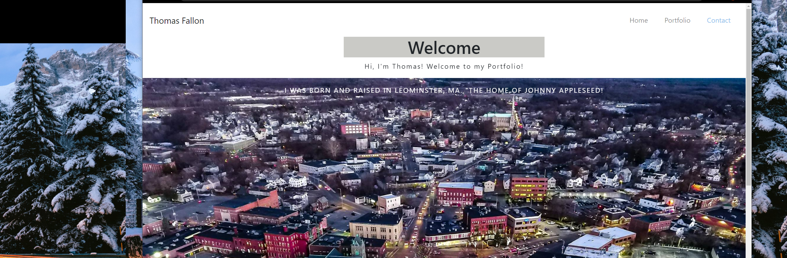

# Portfolio

## Description
For this assignment we were to use Bootstrap CSS Framework to create a mobile responsive portfolio. The Porfolio must be a functional, deployed application using semantic HTML. On the NavBar all links to About, Contact, and Portfolio pages are working properly.

## Technologies Used
* HTML
* CSS
* Bootstrap
* Javascript

## Deployed
[GitHub](https://github.com/TomFallon9/Responsive-Portfolio)

[Website](https://TomFallon9.github.io/Responsive-Portfolio/)

## Resources
* W3 Schools (For help with carousel for my images as well as Boostrap help)
* JavaTpoint
